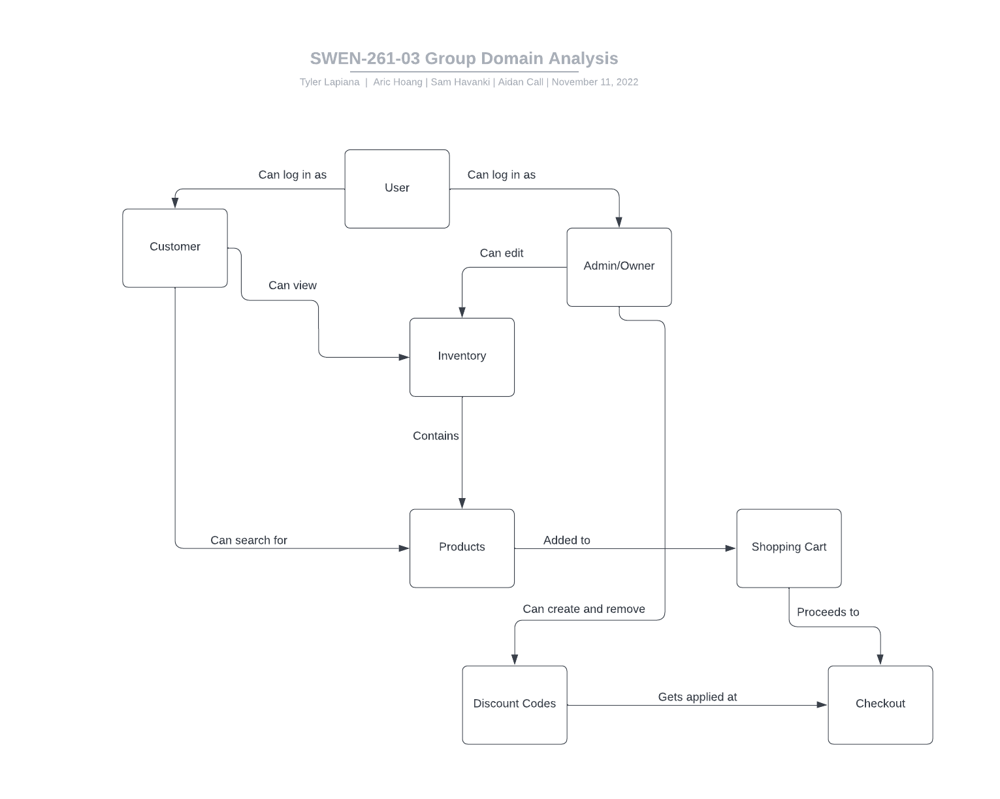

# PROJECT Design Documentation

## Team Information
* Team name: temp-d
* Team members
  * Aidan Call
  * Sam Havanki
  * Aric Hoang
  * Tyler Lapiana

## Executive Summary

### Purpose

This project is the creation of an online store page. We are using Spring Framework to create a REST API for the back-end of the website and Angular for the front-end portion of the website. Our group decided to make a store that sells wheels, for anyone that needs a specific wheel. The users will be customers who can look at the inventory to make purchases and the owner who can edit the inventory.

### Glossary and Acronyms

| Term | Definition |
|------|------------|
| SPA | Single Page |
| Cart/Shop | Shopping Cart |
| Code | Discount Code |
| Items | Inventory |
| FileDAO | Persistence Class |

## Requirements

This section describes the features of the application.

### Definition of MVP

The MVP of this project has two main features, admin features and customer features. Once logged in, a user should be able to find products they want to purchase and checkout. The admin should be able to edit the inventory the store has and have general control of the store.

### MVP Features

- A Login feature that separates admin from the customers
- Admins can edit the inventory of the store by adding, removing, and changing items
- Admins can edit the useable discount codes
- Users can search the store's inventory
- Users can edit their shopping cart by adding and removing items
- Users can checkout (with a discount code)

### Roadmap of Enhancements

At this point, we are not planning of adding any additional enhancements. If this decision changes, the following would be considered first:

- UI/UX Changes to make the store more appealing to the customer. It is very bland right now
- Product Reviews that purchasers can make to let others know their opinion about a product
- Prize Wheel that rewards customers with a discount code when they purchase enough stuff

## Application Domain

This section describes the application domain.

At first, everyone is considered a basic user of the store. Then, after logging in, the user and admin have different functions as seen above. The inventory is one of the most important entities as both the customer and admin functions require the inventory to work properly. It is important to note, that only the user has access to the shopping cart. This also implies that only the users have access to checkout and apply discount codes. 

## Architecture and Design

This section describes the application architecture.

### Summary

The following Tiers/Layers model shows a high-level view of the webapp's architecture.

The e-store web application, is built using the Model–View–ViewModel (MVVM) architecture pattern. 

The Model stores the application data objects including any functionality to provide persistance. 

The View is the client-side SPA built with Angular utilizing HTML, CSS and TypeScript. The ViewModel provides RESTful APIs to the client (View) as well as any logic required to manipulate the data objects from the Model.

Both the ViewModel and Model are built using Java and Spring Framework. Details of the components within these tiers are supplied below.

### Overview of User Interface

This section describes the web interface flow; this is how the user views and interacts
with the e-store application.

When a user opens the website, they are greeted with a login page. Once logged in as a customer, they see a list of items that they can search through. They then can click on items to add them to their cart. On the search page, they can go to their cart where they can see everything as well as proceed to checkout.

### View Tier
As mentioned above, the View tier follows closely with the UI structure described above. The login page takes the user to either the customer dashboard or the admin dashboard. From there, the admin can edit the inventory or logout while the customer can search items, click on items to learn more, logout, or proceed to checkout. The customers add things to the cart of the page where they learn more about the item.

### ViewModel Tier
The ViewModel tier holds code that support the function of the items in the store as well as the cart the customers use. It is here where we can have the code we need to store the objects and information that the store need to function properly. ItemController.java and ItemFileDAO.java provide the function to the Item.java object. ShopController.java and ShopFileDAO.java provide the function to the cart.

### Model Tier
The Model tier holds the information related to items in the shop, discount codes, and user carts. The Item.java class is the model that all items in the store must follow. Items have an id, name, price, and quantity. Id is controlled by the ViewModel, but the name, price, and quantity are all set and changed by the admin. The Code.java class is a model that discount codes must follow, where each has an identifiable code and a percentage off associated with it. Discount codes are sumbitted and changed by the admin, and used by the users. The Cart.java class models a user's cart. Carts each have a username and list of items. The list of carts is controlled by the Shop controller. Items can be added and removed from the cart by users, the admin has no access to the carts.

### Design Principle Analysis
Low Coupling:
Low Coupling should be used in order to reduce unnecessary changes in a system. This results in less room for errors and an easier time to find the bugs that do exist. We exhibited Low Coupling through the use of multiple classes that all hold their own data. That way, when one bit of information changes, it does not affect most of the information in the system.

Single Responsibility:
Single Responsibility is used in order to separate the different aspects of a project into logical groups. This allows for good unit testing, storage, and readability. We exhibited Single Responsibility through the use of separate classes (controller, DAO, Object) for each aspect of the project (Items, Shop, Codes).

Law of Demeter:
The use of the Law of Demeter is ensuring that classes only communicate/are connected to other classes that are necessary for their function. The importance of this is that it ensures the correct information is passed to the correct methods. We acheived this through the connections of the each controller and DAO, but only within each similar group (Item, Shop, Codes).

## Static Code Analysis/Design Improvements

### Analysis
Flag 1:

This is a simple bug that occurs because of the deprication of the "b" HTML tag

Flag 2:

This flag shows the static variable "nextId" being referenced and changed from a non-static method. This can lead to bugs when ther could be multiple class instances or threads.

Flag 3:

This flag shows an issue where we return null instead of an empty array. This can be considered an issue because of the effect it has on the caller of the method. It makes the code more complex and have more room for errors.

### Improvements
Flag 1:
To fix Flag 1, it would be a very simple change, changing the "b" tag with the "strong" tag any time we use it.

Flag 2:
While we do not have to worry about the impact of multiple threads in our project, we should still maintain best practices. To fix this, we should ensure that the method we use is static or find another way to make a static method if needed.

Flag 3:
This is a bit of a longer fix. Any time we use null, we could go through and change the return value to an empty version of whatever is being returned. This means we would have to change the caller of the method to account for the empty case instead of null. 

## Testing

### Acceptance Testing
At current release, all Sprint 4 user stories and acceptance criteria are passed. This means that the MVP along with the 10% feature of discount codes fuction properly.

### Unit Testing and Code Coverage

Our Unit tests account for 99% of code instruction and 90% of possible branches. This gives us an overall code coverage of over 90% of the project.

